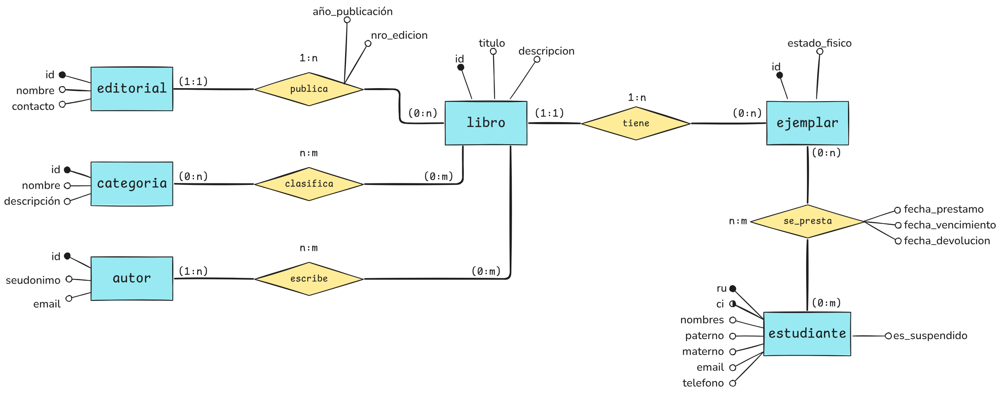
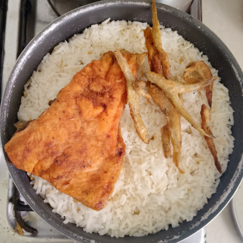

<!-- Logo -->

    

<!-- Title -->
<h1 align="center">Trout & Rice</h1>

<!-- Images -->

    <picture>
         <source media="(prefers-color-scheme: dark)" srcset="./docs/assets/er-v1-dark.png"/>
         <source media="(prefers-color-scheme: light)" srcset="./docs/assets/er-v1-light.png"/>
         
    </picture>

<!-- Description -->

`Trout & Rice` es un **proyecto web** para la **administración de una biblioteca universitaria**. Tiene un uso genérico para cualquier biblioteca, pero el proyecto está enfocado a la carrera de informática.

> [!IMPORTANT]
> 🚧 La versión `v1` del proyecto solo especifica el problema, requerimientos
> y modelos de datos, nada de implementación, todo se encuentra
> en el directorio [`docs/v1/`](./docs/v1/).

## 🏷️ Nombre?

Quería algo genérico como `Library Mangement` o usar una abreviación como `ULM` de _University Library Management_, pero era muy común y me quedé pensando un nombre 😔.

Antes de crear el proyecto, me comí una trucha frita 🐟 con un plato de arroz 🍚, además de unos _ispis_ para acompañar. Entonces, se me hizo gracioso tener un proyecto con el nombre de lo que comí, no tiene sentido, pero quería recordar aquel plato, que con limón sabe más rico 😋.
