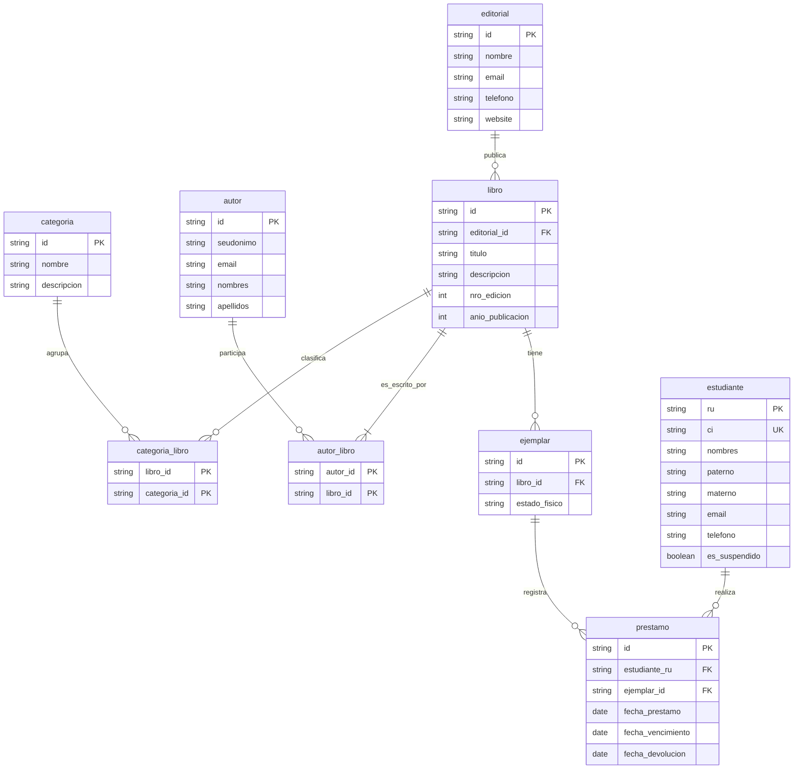

<h1 align="center">🧠 Modelo lógico</h1>

## 🔄 Proceso de transformación E/R a relacional

### 1) Transformación de entidades fuertes a tablas

Cada entidad del modelo E/R se transforma en una tabla con su clave primaria:

- `editorial(id, nombre, email, telefono, website)`
- `categoria(id, nombre, descripcion)`
- `autor(id, seudonimo, email, nombres, apellidos)`
- `libro(id, titulo, descripcion, nro_edicion, anio_publicacion, editorial_id)`
- `ejemplar(id, libro_id, estado_fisico)`
- `estudiante(ru, ci, nombres, paterno, materno, email, telefono, es_suspendido)`

### 2) Transformación de relación 1:N

Relación `publica` (`editorial` 1:N `libro`):

- Se incorpora la FK `editorial_id` en `libro`.
- Los atributos descriptivos de la edición (`nro_edicion`, `anio_publicacion`) se mantienen en `libro` para esta versión simple.

Relación `tiene` (`libro` 1:N `ejemplar`):

- Se incorpora la FK `libro_id` en `ejemplar`.

### 3) Transformación de relaciones N:M sin atributos propios

Relación `escribe` (`autor` N:M `libro`):

- Se crea la tabla puente `autor_libro(autor_id, libro_id)`.
- La PK es compuesta (`autor_id`, `libro_id`).

Relación `clasifica` (`categoria` N:M `libro`):

- Se crea la tabla puente `categoria_libro(libro_id, categoria_id)`.
- La PK es compuesta (`libro_id`, `categoria_id`).

### 4) Transformación de relación N:M con atributos

Relación `se_presta` (`estudiante` N:M `ejemplar`) con atributos `fecha_prestamo`, `fecha_vencimiento`, `fecha_devolucion`:

- Se transforma en tabla transaccional `prestamo`.
- `prestamo` conserva `id` como PK técnica y usa FKs `estudiante_ru` y `ejemplar_id`.
- Los atributos de la relación se registran como columnas propias en `prestamo`.

## 🧩 Reglas lógicas del modelo

### Integridad estructural

1. Toda tabla tiene clave primaria.
2. Toda referencia entre tablas usa clave foránea consistente:
    - `libro.editorial_id -> editorial.id`
    - `ejemplar.libro_id -> libro.id`
    - `autor_libro.autor_id -> autor.id`
    - `autor_libro.libro_id -> libro.id`
    - `categoria_libro.libro_id -> libro.id`
    - `categoria_libro.categoria_id -> categoria.id`
    - `prestamo.estudiante_ru -> estudiante.ru`
    - `prestamo.ejemplar_id -> ejemplar.id`
3. `estudiante.ci` es clave candidata (única).
4. En tablas puente, la PK compuesta evita duplicados de asociación.

### Reglas de validación temporal

1. `fecha_vencimiento >= fecha_prestamo`.
2. `fecha_devolucion` puede ser `NULL` (préstamo abierto).
3. Si `fecha_devolucion` tiene valor, entonces `fecha_devolucion >= fecha_prestamo`.

### Reglas de negocio (control en aplicación)

1. Máximo 4 préstamos abiertos por estudiante.
2. Máximo 1 préstamo abierto por ejemplar.
3. Máximo 1 préstamo abierto del mismo título por estudiante.
4. Sin renovaciones de préstamo.
5. Sin reservas de ejemplares.

### Reglas derivadas

1. Estado del préstamo derivado:
    - Abierto: `fecha_devolucion IS NULL`.
    - Cerrado: `fecha_devolucion IS NOT NULL`.
2. Disponibilidad del ejemplar derivada por ausencia de préstamo abierto del ejemplar.